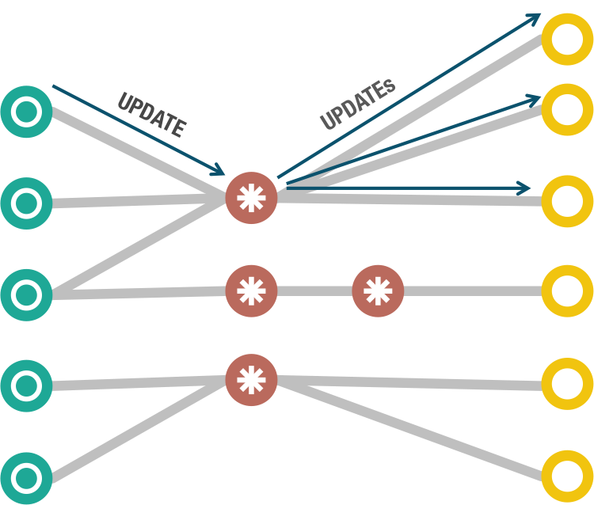
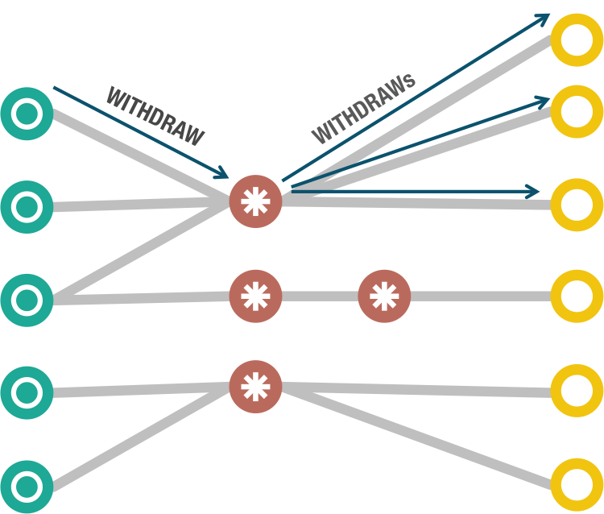
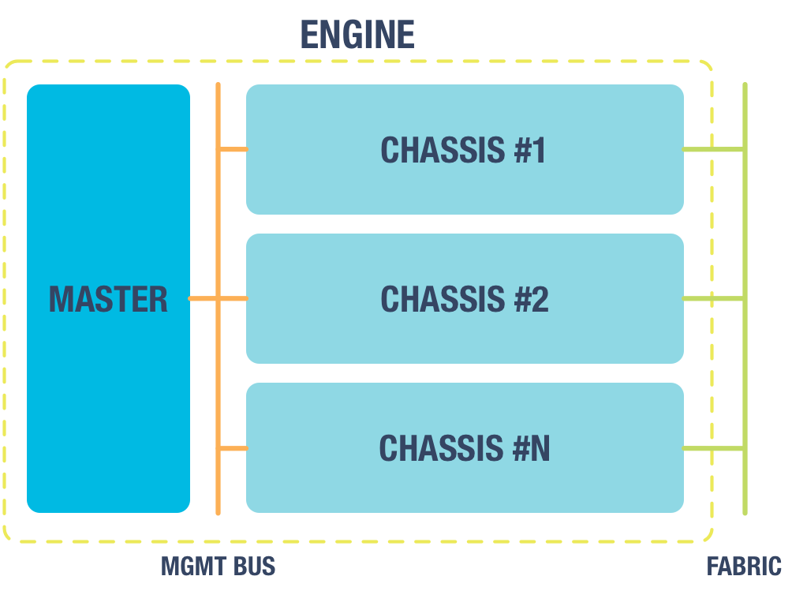

Architecture
============

Processing graph
----------------

The core processing engine of MineMeld is based on a Direct Acyclic Graph
of nodes. Indicators are retrieved or received by Miner nodes and then pushed to
downstream nodes via *update* messages. Nodes can also signal to downstream
nodes the removal of an indicator (in case of expiration, ...) by sending
a *withdraw* message.

Each node in the graph is independent from other nodes, there is no global
state or global clock inside the engine. All the nodes are independent and
asynchrnous. Each node is also responsabile for maintaining its own state.
This architecture trades memory and disk for flexibility.

Node
----

Each node may have 0 or more inputs and 0 or more output. Rather obviuosly
if a node has 0 inputs it is considered a Miner node, if a node has 0 ouput
it is considered an Output node.

Each node also offers a RPC interface, for direct out of band requests, and
a connection to a *management bus* for status checks and management commands
coming from the *management bus master*.

.. image:: images/nodes.png

The connections between nodes are implemented with a pubsub mechanism over
the *fabric*. Each node sends its downstream message to a *topic* named as
the node, and all the downstream nodes are subscribers of this topic.

.. image:: images/topics.png

Runtime architecture
--------------------

To take advantage of all the cores available on the system, the engine
by default automatically splits the nodes of the graph into multiple
processes called *chassis*. Each *chassis* has a dedicated connection
to the *fabric* and to the *management bus*.

The *master* process monitors the health and the metrics of each *chassis*
using the *management bus*. The *master* process is also responsible for
synchronzing the nodes when the engine starts and stops, to ensure that
the state of the graph is consistent. At shutdown this is achieved
using a super simplified version of the Chandy-Lamport checkpoint
algorithm.

Both the *management bus* and the *fabric* are implemented using an
external message broker, RabbitMQ.

