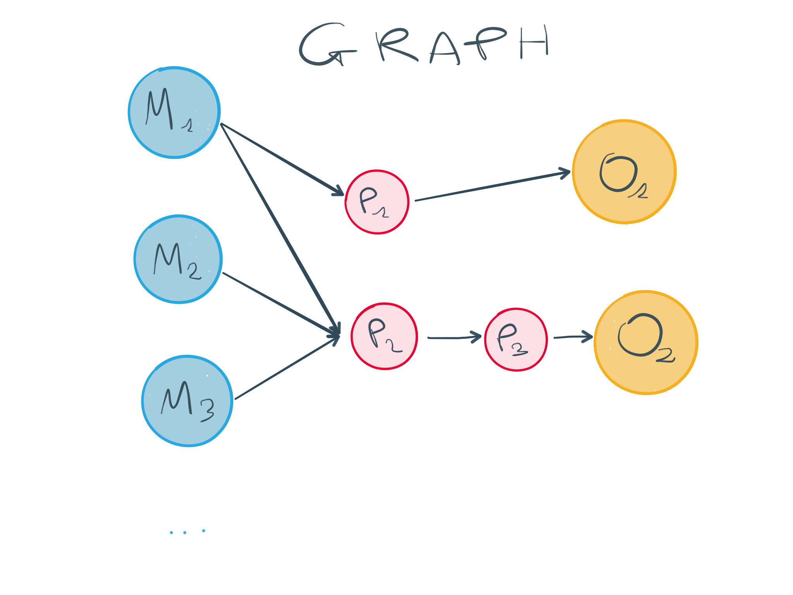
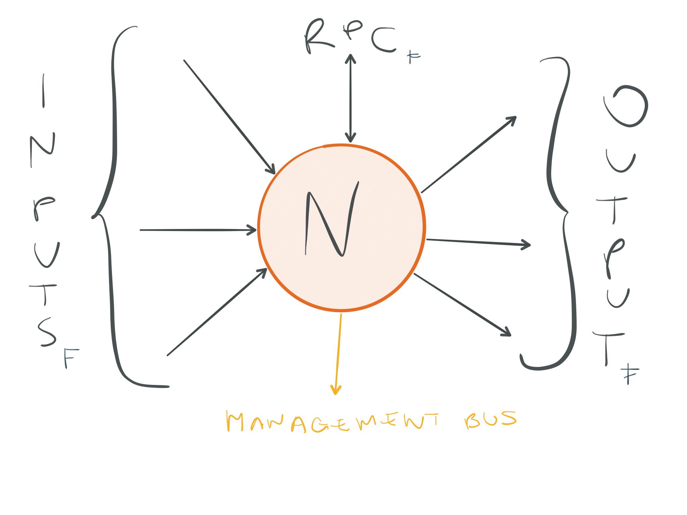
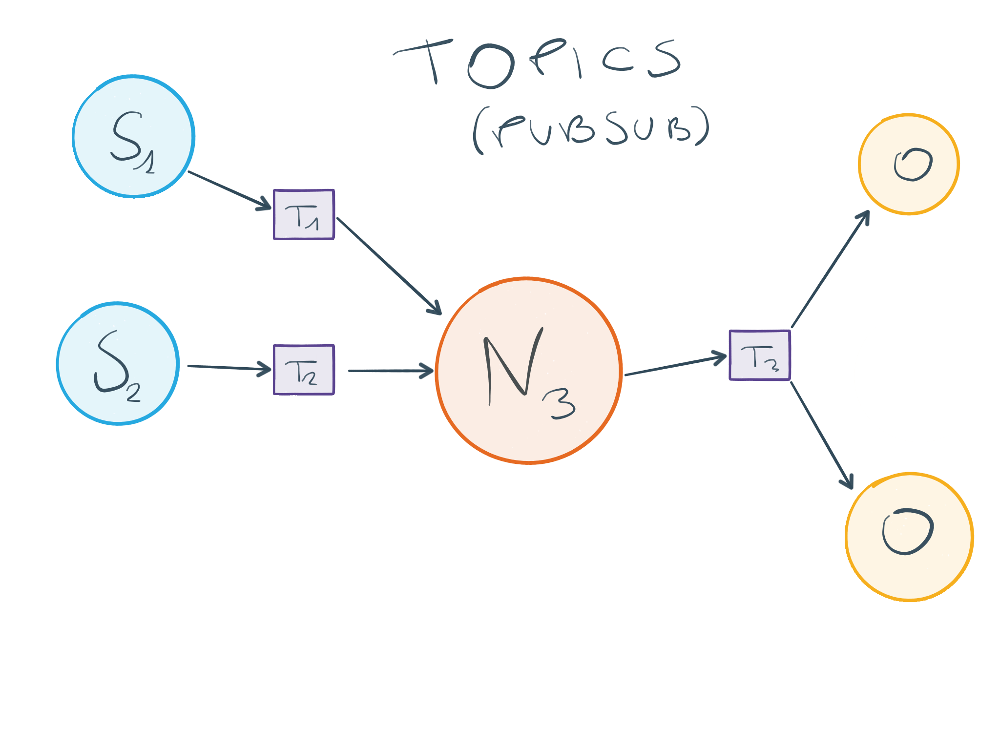

Architecture
============

Processing graph
----------------

The core processing engine of MineMeld is based on DAG of nodes. Indicators
are retrieved by source nodes (Sx in the pictures) and then pushed to
downstream nodes via *update* messages. When an indicator stop being considered
live, it is withdrawn sending a *withdraw* message to downstream nodes.

Typically each node maintains its own table of live indicators, where the
definition of *live* could change according to the node implementation. The
processing engine could be thought as a graph of continuosly updating
materialized views.

Node
----

Each node could have 0 or more inputs and 0 or more output. Rather obviuosly
if a node has 0 inputs it is considered a source node, if a node has 0 ouput
it is considered an output node.

Each node also offers a RPC interface, for directed out of band requests, and
a connection to a *management bus* for status checks and management commands
coming from the *management bus master*.

The connections between nodes are implemented with a pubsub mechanism. Each
node sends its downstream message to a *topic* named as the node, and all
the downstream nodes are subscribers of this topic.

